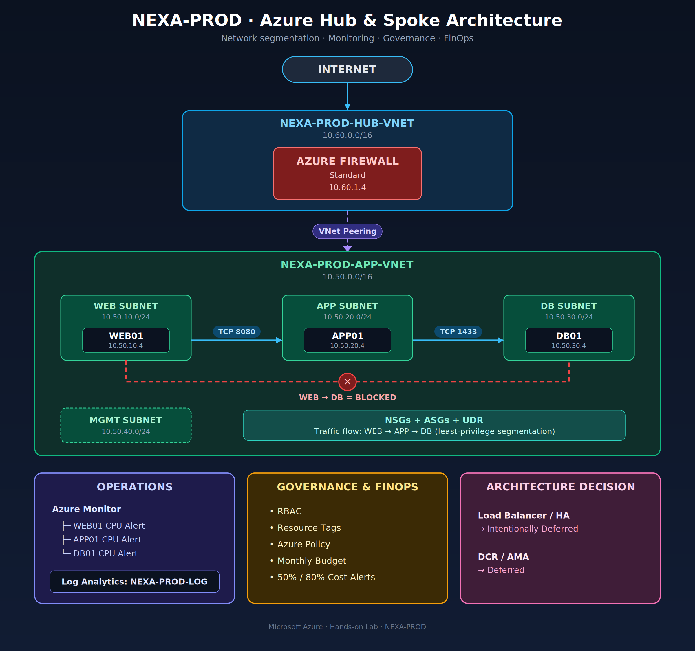

# NexaFiber Azure Cloud Infrastructure

A hands-on Azure infrastructure project designed for a fictional enterprise application environment, focusing on **network segmentation, security, routing, monitoring, governance, and cost management**.
The project demonstrates how an application infrastructure can be designed and migrated into Azure using a **Hub-and-Spoke network architecture** with separate Web, Application, Database, and Management tiers.

## Architecture



## 1. Project Overview

**Project:** NexaFiber Azure Cloud Infrastructure  
**Cloud Platform:** Microsoft Azure  
**Primary Region:** India South Central  
**Resource Group:** `NEXA-PROD-RG`

The objective was to design a secure and operationally manageable Azure environment for a three-tier application.

The environment separates:
- Web workloads
- Application workloads
- Database workloads
- Management workloads

The architecture also introduces centralized firewalling, network routing, security controls, monitoring, governance, and cost controls.

## 2. Business Scenario

NexaFiber is a fictional enterprise organization planning to move part of its application infrastructure to Microsoft Azure.
The application follows a traditional three-tier architecture:

```text
Users
  │
  ▼
Web Tier
  │
  ▼
Application Tier
  │
  ▼
Database Tier
```

The Azure design needed to provide:

- Network segmentation
- Controlled application-to-application communication
- Database isolation
- Centralized network security
- Controlled routing
- Monitoring
- Governance
- Cost visibility

The design intentionally avoids unnecessary services so that the environment remains cost-conscious while still demonstrating realistic cloud architecture principles.


# 3. Architecture

## High-Level Architecture

```text
                         ┌───────────────────┐
                         │     INTERNET      │
                         └─────────┬─────────┘
                                   │
                                   ▼
              ┌─────────────────────────────────────┐
              │        NEXA-PROD-HUB-VNET           │
              │             10.60.0.0/16            │
              │                                     │
              │      ┌──────────────────────┐       │
              │      │  AZURE FIREWALL      │       │
              │      │  Standard            │       │
              │      │  10.60.1.4           │       │
              │      └──────────┬───────────┘       │
              └─────────────────┼───────────────────┘
                                │
                         VNet Peering
                                │
                                ▼
┌──────────────────────────────────────────────────────────────┐
│                  NEXA-PROD-APP-VNET                          │
│                       10.50.0.0/16                           │
│                                                              │
│  ┌──────────────────┐    ┌──────────────────┐                │
│  │ WEB SUBNET       │    │ APP SUBNET       │                │
│  │ 10.50.10.0/24    │    │ 10.50.20.0/24    │                │
│  │                  │    │                  │                │
│  │ WEB01            │───►│ APP01            │                │
│  │ 10.50.10.4       │8080│ 10.50.20.4       │                │
│  └──────────────────┘    └────────┬─────────┘                │
│                                   │                          │
│                                  1433                        │
│                                   ▼                          │
│                         ┌──────────────────┐                 │
│                         │ DB SUBNET        │                 │
│                         │ 10.50.30.0/24    │                  │
│                         │                  │                 │
│                         │ DB01             │                 │
│                         │ 10.50.30.4       │                 │
│                         └──────────────────┘                 │
│                                                              │
│  ┌──────────────────┐                                        │
│  │ MGMT SUBNET      │                                        │
│  │ 10.50.40.0/24   │                                         │
│  └──────────────────┘                                        │
│                                                              │
│  NSGs + ASGs + UDR                                           │
└──────────────────────────────────────────────────────────────┘
```

# 4. Network Design

## Hub VNet

**Name:** `NEXA-PROD-HUB-VNET`

**Address space:**

```text
10.60.0.0/16
```

The hub provides centralized network services.

### Azure Firewall

An Azure Firewall Standard instance is deployed in the hub.

```text
Private IP: 10.60.1.4
```

The hub and application spoke are connected using VNet peering.

## Spoke VNet

**Name:** `NEXA-PROD-APP-VNET`

**Address space:**

```text
10.50.0.0/16
```

The spoke contains the application workloads.

### Subnet Design

| Subnet | CIDR | Purpose |
|---|---|---|
| WEB | `10.50.10.0/24` | Web tier |
| APP | `10.50.20.0/24` | Application tier |
| DB | `10.50.30.0/24` | Database tier |
| MGMT | `10.50.40.0/24` | Management workloads |

The MGMT subnet is reserved for administrative and management workloads but does not currently contain a management VM or Bastion deployment.

# 5. Virtual Machines

| Tier | VM | Private IP |
|---|---|---|
| Web | `NEXA-PROD-WEB01` | `10.50.10.4` |
| Application | `NEXA-PROD-APP01` | `10.50.20.4` |
| Database | `NEXA-PROD-DB01` | `10.50.30.4` |

The workloads are separated by subnet to provide clear network boundaries between application tiers.

# 6. Security Controls

## Network Security Groups

Dedicated NSGs were created for each subnet:

```text
NEXA-PROD-NSG-WEB
NEXA-PROD-NSG-APP
NEXA-PROD-NSG-DB
NEXA-PROD-NSG-MGMT
```

The NSGs restrict traffic according to the application's required communication paths.

## Application Security Groups

ASGs were created to logically group workloads:

```text
NEXA-ASG-WEB
NEXA-ASG-APP
NEXA-ASG-DB
```

This allows security rules to reference application tiers rather than relying only on individual IP addresses.

# 7. Application Traffic Flow

The application follows a controlled three-tier communication model.

### WEB → APP

```text
WEB01
  │
  │ TCP 8080
  ▼
APP01
```

**Allowed**

### APP → DB

```text
APP01
  │
  │ TCP 1433
  ▼
DB01
```

**Allowed**

### WEB → DB

```text
WEB01
  │
  │ TCP 1433
  ▼
DB01
```

**Blocked**

This implements a basic tiered security model where the Web tier cannot directly communicate with the Database tier.

---

# 8. Routing

A route table was created:

```text
NEXA-PROD-RT
```

The route table is associated with the WEB subnet.

A route was configured for:

```text
Destination: 10.60.20.0/24
Next hop: Azure Firewall
Next-hop IP: 10.60.1.4
```

Effective routes were validated during the implementation.

---

# 9. Monitoring

A Log Analytics workspace was created:

```text
NEXA-PROD-LOG
```

Basic Azure VM monitoring was implemented using Azure Monitor metrics.

CPU alerts were configured for all three production VMs.

### Alerts

```text
NEXA-PROD-WEB01-CPU-HIGH
NEXA-PROD-APP01-CPU-HIGH
NEXA-PROD-DB01-CPU-HIGH
```

The CPU threshold was configured at:

```text
CPU > 80%
```

with average aggregation and a 5-minute evaluation window.

Advanced guest OS monitoring using Azure Monitor Agent/DCR was intentionally deferred.

---

# 10. Governance & RBAC

## RBAC

Resource-group access was reviewed through Azure IAM.

The project currently uses subscription-level Owner access inherited by the project administrator.

No unnecessary RBAC changes were made to avoid disrupting the learning environment.

---

## Resource Tags

The resource group uses governance-oriented tags:

| Tag | Value |
|---|---|
| Environment | Production |
| Project | NexaFiber |
| ManagedBy | Azure |
| CostCenter | NEXA-001 |

These tags provide basic environment identification and cost/governance metadata.

---

# 11. Azure Policy

Existing Azure Policy assignments were reviewed.

The environment includes Azure's existing security-related policy initiative and a resource-region policy.

Rather than adding restrictive policies without a business requirement, the project intentionally avoided introducing policies that could interfere with the existing architecture.

This demonstrates an important governance principle:

> Policies should support the architecture and business requirements rather than being added simply for the sake of having more policies.

---

# 12. FinOps / Cost Management

Cost management was treated as part of the architecture rather than an afterthought.

A monthly budget was created for:

```text
NEXA-PROD-RG
```

Budget alert thresholds were configured at:

```text
50% → Warning
80% → Critical
```

This provides early visibility into unexpected resource spending.

Unnecessary test resources outside the NEXA environment were also reviewed and cleaned up during the broader Azure cost-management exercise.

---

# 13. Design Decisions

### Why Hub-and-Spoke?

The hub provides a centralized location for shared network security services while the spoke isolates application workloads.

### Why separate WEB, APP and DB subnets?

The separation creates clear security boundaries and allows traffic to be controlled independently between application tiers.

### Why use NSGs and ASGs?

NSGs enforce network-level access rules, while ASGs provide logical application grouping.

### Why have a MGMT subnet?

The MGMT subnet provides a dedicated location for future administrative and management workloads without mixing them with application traffic.

### Why no Load Balancer?

High availability and load balancing were intentionally deferred rather than deploying additional resources without a current requirement.

### Why no DCR/AMA?

Advanced guest OS monitoring was deferred after encountering regional availability constraints during the monitoring configuration. Basic Azure Monitor metrics and CPU alerts were sufficient for the current project scope.

---

# 14. What Was Validated

The following were tested during implementation:

- Hub-to-spoke connectivity
- VNet peering
- Effective routes
- NSG configuration
- ASG associations
- WEB → APP TCP 8080
- APP → DB TCP 1433
- WEB → DB TCP 1433 blocked
- Azure Monitor CPU alerts
- Resource-group governance tags
- RBAC configuration
- Cost budget alerts

---

# 15. Key Learnings

This project provided hands-on experience with:

- Azure Virtual Networks
- Subnet design
- Hub-and-Spoke architecture
- Azure Firewall
- VNet peering
- User Defined Routes
- Network Security Groups
- Application Security Groups
- Linux Azure VMs
- Application-tier
